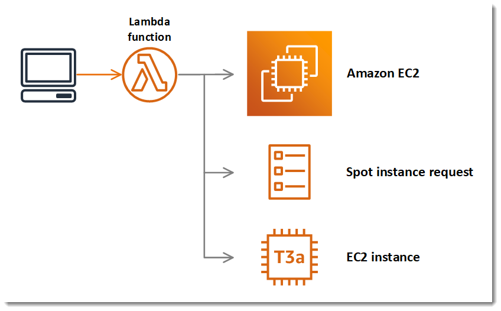
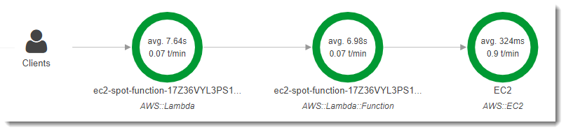
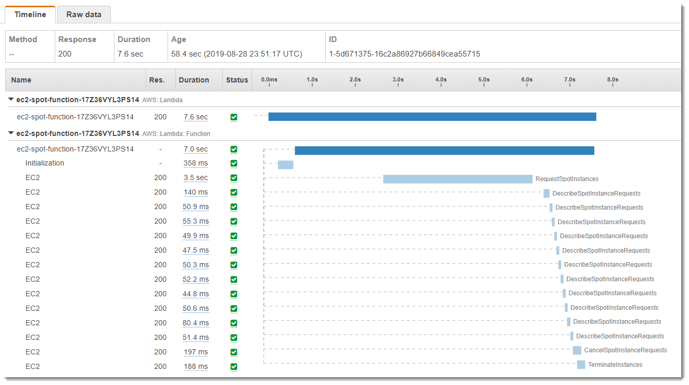

.. Copyright 2010-2019 Amazon.com, Inc. or its affiliates. All Rights Reserved.

   This work is licensed under a Creative Commons Attribution-NonCommercial-ShareAlike 4.0
   International License (the "License"). You may not use this file except in compliance with the
   License. A copy of the License is located at http://creativecommons.org/licenses/by-nc-sa/4.0/.

   This file is distributed on an "AS IS" BASIS, WITHOUT WARRANTIES OR CONDITIONS OF ANY KIND,
   either express or implied. See the License for the specific language governing permissions and
   limitations under the License.

.. _tutorial-spot-instances-net:

###############################################################
Tutorial: Using |sdk-net| to Manage |EC2| Spot Instances
###############################################################

You can use the |sdk-net| to manage |EC2| spot instances with C# code. The SDK enables you to use the |EC2| API to create spot instance requests, determine when the request is fulfilled, delete requests, and identify the instances created.

This tutorial provides code that performs these tasks and a sample application that you can run locally or on AWS. It includes a sample project that you can deploy to |LAMlong|'s .NET Core 2.1 runtime.

For more information about spot instances usage and best practices, see `Spot Instances <https://alpha-docs-aws.amazon.com/AWSEC2/latest/DeveloperGuide/using-spot-instances.html>`_ in the |EC2| user guide.

Prerequisites
=============

To follow the procedures in this guide, you will need a command line terminal or shell to run commands. Commands are shown in listings preceded by a prompt symbol ($) and the name of the current directory, when appropriate:

.. code-block:: sh

  ~/lambda-project$ this is a command
  this is output

For long commands, an escape character (\\) is used to split a command over multiple lines.

On Linux and macOS, use your preferred shell and package manager. On Windows 10, you can `install the Windows Subsystem for Linux <https://docs.microsoft.com/en-us/windows/wsl/install-win10>`_ to get a Windows-integrated version of Ubuntu and Bash.

This tutorial uses code from the developer guide's GitHub repository. The repository also contains helper scripts and configuration files that are needed to follow its procedures. Clone the repository at `github.com/awsdocs/aws-net-developer-guide <https://github.com/awsdocs/aws-net-developer-guide>`_.

To use the sample code you need the following tools:

* **AWS CLI** – To deploy the sample application to AWS, install the `AWS CLI <https://alpha-docs-aws.amazon.com/cli/latest/userguide/cli-chap-install.html>`_. The |cli| also provides credentials to the sample code when you run it locally.

* **NET Core CLI** – To run and test the code locally, install the `.NET Core SDK 2.1 <https://dotnet.microsoft.com/download/dotnet-core/2.1>`_.

* **Lambda .NET Core Global Tool** – To build the deployment package for |LAM|, install the `.NET Core Global Tool <https://dotnet.microsoft.com/download/dotnet-core/2.1>`_ with the .NET Core CLI.

    .. code-block:: sh

      $ dotnet tool install -g Amazon.Lambda.Tools

The code in this tutorial manages spot requests that launch |EC2| instances. To run the code locally, you need SDK credentials with permission to use the following APIs.

* :code:`ec2:RequestSpotInstance`

* :code:`ec2:GetSpotRequestState`

* :code:`ec2:CancelSpotRequest`

* :code:`ec2:TerminateInstances`

To run the sample application in AWS, you need permission to use |LAM|, |S3long| and |CFNlong|. See `Permissions <https://docs.aws.amazon.com/lambda/latest/dg/lambda-permissions.xml>`_ in the |LAM| developer guide for more information.

Review the Code
===============

Locate the sample project in the guide repository under `sample-apps/ec2-spot <https://github.com/awsdocs/aws-net-developer-guide/tree/master/sample-apps/ec2-spot>`_. This directory contains |LAM| function code, tests, project files, scripts, and an |CFN| template.

The Function class includes a FunctionHandler method that calls other methods to create spot requests, check their status, and clean up. It creates an |EC2| client with the |sdk-net| in a static constructor to allow it to be used throughout the class.

**Function.cs** – `FunctionHandler <https://github.com/awsdocs/aws-net-developer-guide/blob/master/sample-apps/ec2-spot/src/ec2spot/Function.cs#L17>`_

.. code-block:: csharp

    using Amazon.EC2;
    ...
        public class Function
        {
            private static AmazonEC2Client ec2Client;

            static Function() {
              AWSSDKHandler.RegisterXRayForAllServices();
              ec2Client = new AmazonEC2Client();
            }

            public async Task<string> FunctionHandler(Dictionary<string, string> input, ILambdaContext context)
            {
              // More AMI IDs: aws.amazon.com/amazon-linux-2/release-notes/
              // us-east-2  HVM  EBS-Backed  64-bit  Amazon Linux 2
              string ami = "ami-09d9edae5eb90d556";
              string sg = "default";

              InstanceType type = InstanceType.T3aNano;
              string price = "0.003";
              int count = 1;
              var requestSpotInstances = await RequestSpotInstance(ami, sg, type, price, count);
              var spotRequestId = requestSpotInstances.SpotInstanceRequests[0].SpotInstanceRequestId;

The :sdk-net-api:`RequestSpotInstances <EC2/MEC2RequestSpotInstancesRequestSpotInstancesRequest>` method creates a spot instance request.

**Function.cs** – `RequestSpotInstance <https://github.com/awsdocs/aws-net-developer-guide/blob/master/sample-apps/ec2-spot/src/ec2spot/Function.cs#L59>`_

.. code-block:: csharp

    using Amazon;
    using Amazon.Util;
    using Amazon.EC2;
    using Amazon.EC2.Model;
    ...
        public async Task<RequestSpotInstancesResponse> RequestSpotInstance(
          string amiId,
          string securityGroupName,
          InstanceType instanceType,
          string spotPrice,
          int instanceCount)
        {
          var request = new RequestSpotInstanceRequest();

          var launchSpecification = new LaunchSpecification();
          launchSpecification.ImageId = amiId;
          launchSpecification.InstanceType = instanceType;
          launchSpecification.SecurityGroups.Add(securityGroupName);

          request.SpotPrice = spotPrice;
          request.InstanceCount = instanceCount;
          request.LaunchSpecification = launchSpecification;

          RequestSpotInstancesResponse response =  await ec2Client.RequestSpotInstancesAsync(request);

          return response;
        }
    ...

Next, you need to wait until the spot request reaches the Active state before proceeding to the last step. To determine the state of your spot request, use the :sdk-net-api:`DescribeSpotInstanceRequests <EC2/TDescribeSpotInstanceRequestsRequest>` method to obtain the state of the spot request ID to monitor.

.. code-block:: csharp

    public async Task<SpotInstanceRequest> GetSpotRequest(string spotRequestId)
    {
      var request = new DescribeSpotInstanceRequestsRequest();
      request.SpotInstanceRequestIds.Add(spotRequestId);

      var describeResponse = await ec2Client.DescribeSpotInstanceRequestsAsync(request);

      return describeResponse.SpotInstanceRequests[0];
    }

The final step is to clean up your requests and instances. It is important to both cancel any outstanding requests and terminate any instances. Just canceling your requests will not terminate your instances, which means that you will continue to be charged for them. If you terminate your instances, your Spot requests may be canceled, but there are some scenarios, such as if you use persistent requests, where terminating your instances is not sufficient to stop your request from being re-fulfilled. Therefore, it is a best practice to both cancel any active requests and terminate any running instances.

You use the :sdk-net-api:`CancelSpotInstanceRequests
<EC2/MEC2CancelSpotInstanceRequestsCancelSpotInstanceRequestsRequest>` method to cancel a Spot request. The following example demonstrates how to cancel a Spot request.

.. code-block:: csharp

    public async Task CancelSpotRequest(string spotRequestId)
    {
      Console.WriteLine("Canceling request " + spotRequestId);
      var cancelRequest = new CancelSpotInstanceRequestsRequest();
      cancelRequest.SpotInstanceRequestIds.Add(spotRequestId);

      await ec2Client.CancelSpotInstanceRequestsAsync(cancelRequest);
    }

You use the :sdk-net-api:`TerminateInstances <EC2/MEC2TerminateInstancesTerminateInstancesRequest>` method to terminate an instance.

.. code-block:: csharp

    public async Task TerminateSpotInstance(string instanceId)
    {
      Console.WriteLine("Terminating instance " + instanceId);
      var terminateRequest = new TerminateInstancesRequest();
      terminateRequest.InstanceIds = new List<string>() { instanceId };
      try
      {
        var terminateResponse = await ec2Client.TerminateInstancesAsync(terminateRequest);
      }
      catch (AmazonEC2Exception ex)
      {
        // Check the ErrorCode to see if the instance does not exist.
        if ("InvalidInstanceID.NotFound" == ex.ErrorCode)
        {
          Console.WriteLine("Instance {0} does not exist.", instanceId);
        }
        else
        {
          // The exception was thrown for another reason, so re-throw the exception.
          throw;
        }
      }
    }

Run the Code Locally
====================

Run the code on your local machine to create a spot instance request. After the request is fulfilled, the code deletes the request and terminates the instance.

.. topic:: To run the application code

    #.  Navigate to the ec2Spot.Tests directory.

        .. code-block:: sh

            $ cd test/ec2Spot.Tests

    #.  Use the .NET CLI to run the project's unit tests.

        .. code-block:: sh

            test/ec2Spot.Tests$ dotnet test
            Starting test execution, please wait...
            sir-x5tgs5ij
            open
            open
            open
            open
            open
            active
            Canceling request sir-x5tgs5ij
            Terminating instance i-0b3fdff0e12e0897e
            Complete

            Test Run Successful.
            Total tests: 1
                 Passed: 1
             Total time: 7.6060 Seconds

The unit test invokes the :code:`FunctionHandler` method to create a spot instance request, monitor it, and clean up. It is implemented in `xUnit.net <https://xunit.net/>`_ testing framework.

Deploy the Application
======================

Run the code in |LAM| as a starting point for creating a serverless application.

.. topic:: To deploy and test the application

    #.  Set your region to us-east-2.

        .. code-block:: sh

            $ export AWS_DEFAULT_REGION=us-east-2

    #.  Create a bucket for deployment artifacts.

        .. code-block:: sh

            $ ./create-bucket.sh
            make_bucket: lambda-artifacts-63d5cbbf18fa5ecc

    #.  Create a deployment package and deploy the application.

        .. code-block:: sh

            $ ./deploy.sh
            Amazon Lambda Tools for .NET Core applications (3.3.0)
            Project Home: https://github.com/aws/aws-extensions-for-dotnet-cli, https://github.com/aws/aws-lambda-dotnet

            Executing publish command
            ...
            Created publish archive (ec2spot.zip)
            Lambda project successfully packaged: ec2spot.zip
            Uploading to ebd38e401cedd7d676d05d22b76f0209  1305107 / 1305107.0  (100.00%)
            Successfully packaged artifacts and wrote output template to file out.yaml.
            Execute the following command to deploy the packaged template
            aws cloudformation deploy --template-file out.yaml --stack-name <YOUR STACK NAME>

            Waiting for changeset to be created..
            Waiting for stack create/update to complete
            Successfully created/updated stack - ec2-spot

    #.  Open the `Application page <https://us-east-2.console.aws.amazon.com/lambda/home?region=us-east-2#/applications/ec2-spot>`_ in the |LAM| console.

        .. image:: ../../../sample-apps/ec2-spot/images/sample-ec2spot-application.png

    #.  Under Resources, choose :guilabel:`function`.

    #.  Choose :guilabel:`Test` and create a test event from the default template.

    #.  Choose :guilabel:`Test` again to invoke the function.

View the logs and trace information to see the spot request ID and sequence of calls to |EC2|.

To view the service map, open the `Service map page <https://console.aws.amazon.com/xray/home#/service-map>`_ in the |xraylong| console.

Choose a node in the service map and then choose :guilabel:`View traces` to see a list of traces. Choose a trace from the list to see the timeline of calls that the function made to |EC2|.

Clean Up
========

The code provided in this tutorial is designed to create and delete spot instance requests, and to terminate the instances that they launch. However, if an error occurs, the requests and instances might not be cleaned up automatically. View the spot requests and instances in the |EC2| console.

.. topic:: To confirm that |EC2| resources are cleaned up

    #.  Open the `Spot Requests page <https://console.aws.amazon.com/ec2sp/v1/spot/home>`_ in the |EC2| console.

    #.  Verify that the state of the requests is :guilabel:`Cancelled.`

    #.  Choose the instance ID in the :guilabel:`Capacity` column to view the instance.

    #.  Verify that the state of the instances is :guilabel:`Terminated` or :guilabel:`Shutting down`.

To clean up the sample function and support resources, delete its |CFN| stack and the artifacts bucket that you created.

.. code-block:: sh

    $ ./cleanup.sh
    Delete deployment artifacts and bucket (lambda-artifacts-63d5cbbf18fa5ecc)?y
    delete: s3://lambda-artifacts-63d5cbbf18fa5ecc/ebd38e401cedd7d676d05d22b76f0209
    remove_bucket: lambda-artifacts-63d5cbbf18fa5ecc

The function's log group is not deleted automatically. You can delete it in the `CloudWatch Logs console <https://console.aws.amazon.com/cloudwatch/home#logs:>`_. Traces in |xray| expire after a few weeks and are deleted automatically.