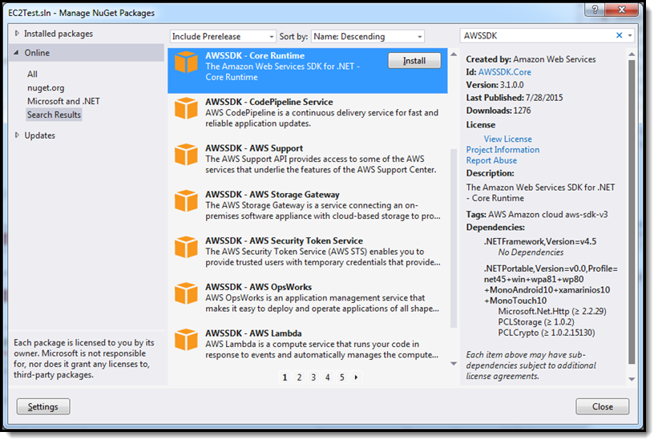

.. Copyright 2010-2016 Amazon.com, Inc. or its affiliates. All Rights Reserved.

   This work is licensed under a Creative Commons Attribution-NonCommercial-ShareAlike 4.0
   International License (the "License"). You may not use this file except in compliance with the
   License. A copy of the License is located at http://creativecommons.org/licenses/by-nc-sa/4.0/.

   This file is distributed on an "AS IS" BASIS, WITHOUT WARRANTIES OR CONDITIONS OF ANY KIND,
   either express or implied. See the License for the specific language governing permissions and
   limitations under the License.

.. _net-dg-install-assemblies:

#########################
Install AWSSDK Assemblies
#########################

You can install the AWSSDK assemblies in one of two ways:

* :ref:`net-dg-install-net-sdk`

* :ref:`net-dg-nuget`

.. _net-dg-install-net-sdk:

Install the |sdk-net|
---------------------

The following procedure describes how to install the |TFW|, which contains the |sdk-net|.

.. tip:: The |sdk-net| is also available on `GitHub <https://github.com/aws/aws-sdk-net>`_.

**To install the AWS Tools for Windows**

1. Go to |sdk-net|_.

2. In the :guilabel:`Downloads` section, choose :guilabel:`AWS SDK for .NET` to download the installer.

3. To begin the installation process, run the downloaded installer and follow the on-screen
   instructions.

    .. tip:: By default, the |TFW| are installed in the *Program Files* directory, which requires administrator
       privileges. To install the |TFW| as a non-administrator, specify a different installation
       directory.

4. (Optional) You can use NuGet to install individual AWSSDK service assemblies, and extensions for the
   |sdk-net|, which include a session state provider and a trace listener. For more information,
   see :ref:`net-dg-nuget`.

   
.. _net-dg-nuget:

Install AWSSDK Assemblies with NuGet
------------------------------------

`NuGet <http://nuget.org/>`_ is a package management system for the .NET platform. With NuGet, you
can add the AWSSDK assemblies, as well as the 
`TraceListener <http://www.nuget.org/packages/AWS.TraceListener>`_ and 
`SessionProvider <http://www.nuget.org/packages/AWS.SessionProvider>`_ extensions, to your
application.

NuGet always has the most recent versions of the AWSSDK assemblies, and also enables you to install
previous versions. NuGet is aware of dependencies between assemblies and installs all required
assemblies automatically. Assemblies installed with NuGet are stored with your solution rather than
in a central location, such as :code:`Program Files`. This enables you to install assembly versions
specific to a given application without creating compatibility issues for other applications.

For more information about NuGet, go to the `NuGet documentation <http://docs.nuget.org/>`_.

To use NuGet, install it from the `Visual Studio Gallery on MSDN
<http://visualstudiogallery.msdn.microsoft.com/27077b70-9dad-4c64-adcf-c7cf6bc9970c>`_. If you are
using Visual Studio 2010 or later, NuGet is installed automatically.

You can use NuGet either from :guilabel:`Solution Explorer` or from the :guilabel:`Package Manager
Console`.

.. contents:: **Topics**
    :local:
    :depth: 1

.. _packages:

NuGet AWSSDK Packages
---------------------

The NuGet website provides a page for every package available through NuGet. The page for each
package includes a sample command line for installing the package using the Package Manager console.
Each page also includes a list of the previous versions of the package that are available through
NuGet. For a list of AWSSDK packages available from NuGet, go to `AWSSDK Packages
<http://www.nuget.org/profiles/awsdotnet>`_.

.. _package-install-gui:

NuGet from Solution Explorer
----------------------------

To use NuGet from Solution Explorer, right-click on your project and choose :guilabel:`Manage NuGet
Packages` from the context menu.

From the :guilabel:`Manage NuGet Packages` dialog box, in the left pane, choose :guilabel:`Online`.
You can then use the search box in the upper-right corner to search for the package you want to
install. The screenshot shows the :guilabel:`AWSSDK - Auto Scaling` assembly package. You'll see
NuGet is aware this package has a dependency on the :code:`AWSSDK.Core` assembly package; NuGet will
therefore install the :code:`AWSSDK.Core` package if it is not already installed.

.. _package-install-cmd:

NuGet Package Manager Console
-----------------------------

To use NuGet from the Package Manager Console in Visual Studio:

Visual Studio 2010
    From the :guilabel:`Tools` menu, choose :guilabel:`Library Package Manager`, and click
    :guilabel:`Package Manager Console`.

Visual Studio 2012 and later
    From the :guilabel:`Tools` menu, choose :guilabel:`Nuget Package Manager`, and click
    :guilabel:`Package Manager Console`.

From the Package Manager Console, you can install the desired AWSSDK assemblies using the
*Install-Package* command. For example, to install the `AWSSDK.AutoScaling
<http://www.nuget.org/packages/AWSSDK.AutoScaling>`_ assembly, use the following command:

.. code-block:: sh

    PM> Install-Package AWSSDK.AutoScaling

NuGet will also install any dependencies, such as `AWSSDK.Core
<http://www.nuget.org/packages/AWSSDK.Core>`_.

To install an earlier version of a package, use the :code:`-Version` option and specify the desired
package version. For example, to install version 1.5.1.0 of the |sdk-net| assembly, use the
following command line:

.. code-block:: sh

    PM> Install-Package AWSSDK.AutoScaling -Version 3.0.0.1

For more information about Package Manager Console commands, see 
`Package Manager Console Commands (v1.3) <http://nuget.codeplex.com/wikipage?title=Package%20Manager%20Console%20Command%20Reference%20%28v1.3%29>`_.
